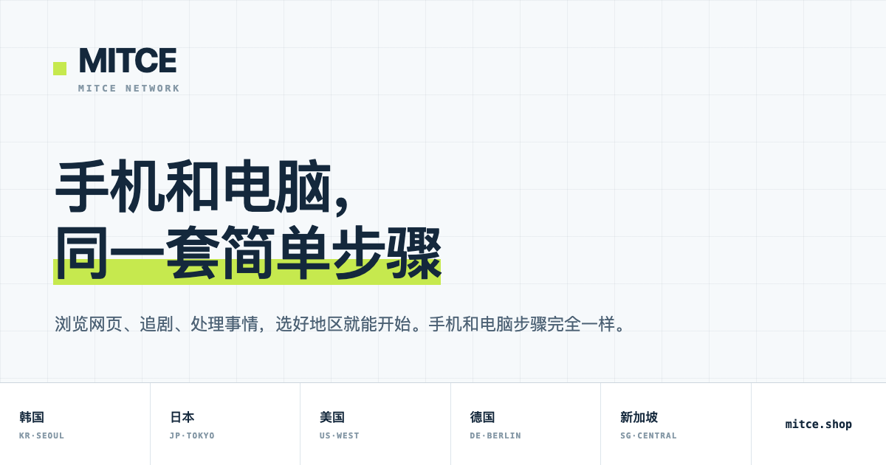

# 三步就能看懂起点？MITCE 把手机和电脑放到了一条线上

有些人不是怕设置，而是怕手机一套说明、电脑又是另一套。MITCE 的公开页面把两类设备写进同一套三步连接流程。这个安排很利落：先给出共同路径，再让用户按设备继续核对。

如果你喜欢先看步骤再决定，[从 MITCE 当前流程入口开始](https://www.mitce.shop)会比四处找教程轻松。

## “三步”的价值，在于顺序清楚

它没有让手机与电脑变成两座信息孤岛，这是公开说明里最吸引人的点。访问时准备好系统版本、常用网络和目标地区，再[逐步查看设备要求](https://www.mitce.shop)，流程才真正有参考价值。需要安装包时，可从[MITCE 下载页面](https://www.mitce.shop)进入。

三步流程把设备、连接和订阅顺序安排得很清楚，套餐和使用边界可在[MITCE 服务说明](https://www.mitce.shop)中继续查看。

## 操作时，只认最新指引

MITCE 的落地页把手机和电脑放进同一套三步流程，先确定设备，再跟着连接和订阅说明走。这个顺序对第一次使用的人很友好，也方便已经在电脑端使用、后来想切到手机的人继续操作。

## 套餐与设备

公开月付档位从 50 GB / ￥6 起，往上有 120 GB / ￥10、500 GB / ￥20 和 1500 GB / ￥50，设备上限分别为 4、6、10、60 台。常用系统的安装步骤可在[MITCE 客户端入口](https://www.mitce.shop)查看。

## FAQ

**Q：三步流程复杂吗？** 页面按设备拆开说明，手机和电脑都能从同一起点开始。

**Q：适合办公和影音吗？** 落地页将日常浏览、影音与效率工具列为常用场景。

**Q：套餐怎么选？** 按每月流量和同时在线设备数，对照[MITCE 当前套餐](https://www.mitce.shop)即可。
